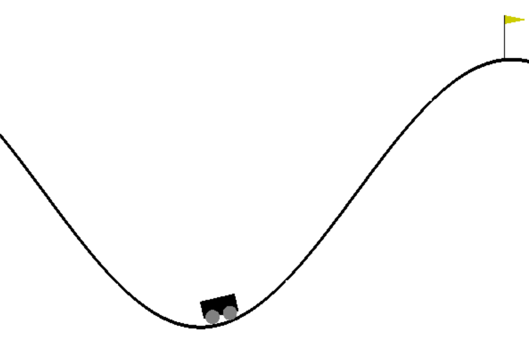

# Table Of Content
***

- `deepQLearningSimple.py ` DQN agent functions   
- `trainingEvaluation_v0.ipynb` results from trainnig with 500 episodes
- `trainingEvaluation_v1.ipynb` results from training with 1000 episodes
- `demo.py` run a demo with success models: 10, 50, 80, 100, 318

**Demo**  
In order to visualize the learning progressive, 6 ordered demo models can be run with with `python demo.py` in shell. 

**Training**  
1. Change in `deepQLearningSimple.py` the `try_name` = *{tryname}*   
2. run  in shell/ `python deepQLearningSimple.py` 
3. A directory with the *{tryname}* is made under history/*{tryname}* and data/*{tryname}*

# Project Motivation
***
This code was designed associated with my master thesis,
"Aspects of Sequential Decision Making Reinforcement Learning and Bandit Problem", Institution for Mathematical Stochastics, Otto-von-Guericke-Universität, 2019. 

The project is about solving a reinforcement problem with an Deep Q-network agent based on the paper et al. Mnih, "Human-level control through deep reinforcement learning", Nature 2015.

# Mountain Car with Deep Q-Learning
***

## Game Environment

The playbox from `openAI` for developing and comparing reinforcement learning algorithms is the library called `gym`.
This library includes several environments or test problems that can be solved with reinforcement algorithms. 
It provides natural shared interfaces, which enables to skip the complex manual feature engineering. 

This project captures the learning problem `MountainCar`. 
Here is the challenge that a car, stocked between two hills, need to climb the right hill, but a single impulse causes a to less momentum. The only way to solve the problem is that the agent drives front and back in order to generate a stronger momentum. 
Moore first described the problem in his PhD thesis: "Efficient Memory-Based Learning for Robot Control", University of Cambridge, 1990.

This is the `MountainCar` evironment from gym.

The spaces for the action is disrcet and there are 3 possible actions availible.

number | action  
-------|-------  
0      | push left
1      | no operation
2      | push right

The observation is an `2` dimensional vector. The first dimension tells the position of the car and the second the velocity.

number | sate      | vakues
-------|-----------|------------  
i_1t   | position  | [-1.2, 0.6]
i_2t   | velocity  | [-0.07, 0.07]

## Reward 

- The original reward is set to be -1 for each time step except the goal position of 0.5 is reached.

- The mutated reward is adjusted to be i_1t appart from the goal state. Here is the reward set as 10. 

## Terminal State
The terminal state determnines the end of an epsiode and is either the state at time 500 or the the goal state at position 0.5.